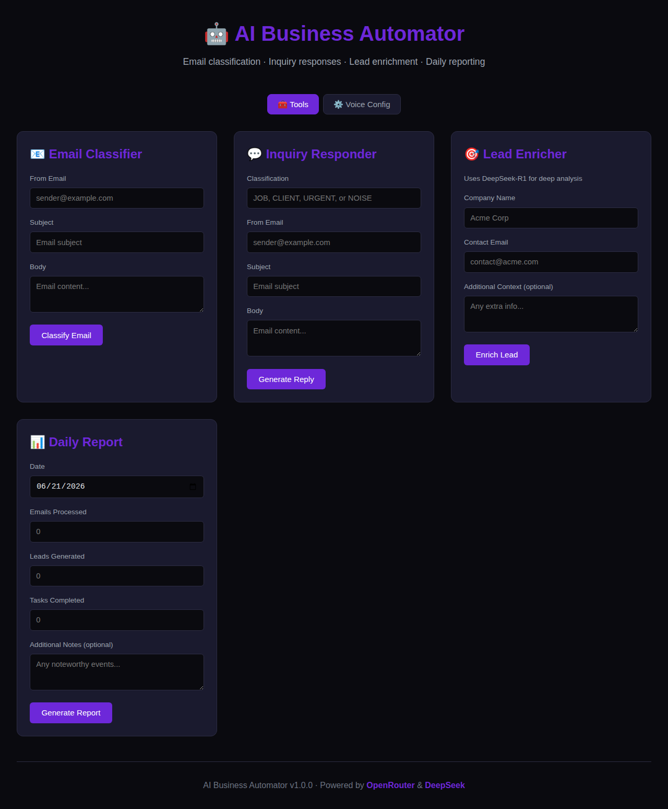

# AI Business Automator

> Python-native replacement for 4 buggy n8n workflows — AI-powered email classification, lead enrichment, inquiry response automation, and daily reporting.

## Overview

This system replaces a fragile n8n node-graph with a single FastAPI server. Every workflow from the original setup was reimplemented as a Python endpoint — testable, version-controlled, and deployable as a Docker container.


## Features

- **Email Classification** — Parses inbound messages, classifies intent via OpenRouter/DeepSeek
- **Inquiry Response** — Auto-generates contextual replies with LLM reasoning
- **Lead Enrichment** — Extracts key data points from inquiry threads
- **Daily Reporting** — Summarizes daily activity with actionable metrics
- **Audit Trail** — Every action logged with timestamps and reasoning
- **Docker-Ready** — One-command deploy to Hugging Face Spaces or any Docker host



## Why Replace n8n?

| Problem | Solution |
|---------|----------|
| n8n Respond node couldn't evaluate `{{ }}` expressions | Python string formatting — predictable, testable |
| Webhook timeouts / 504s | FastAPI with proper async handling |
| No unit testability | `pytest` + `httpx` for full integration tests |
| No version control | Git-tracked codebase |
| Monolithic node graphs | Modular service architecture |

## Quick Start

```bash
pip install -r requirements.txt
python server.py
# → http://localhost:8770
```

### Docker

```bash
docker build -t ai-automator .
docker run -p 8770:8770 ai-automator
```

### Environment

Set `OPENROUTER_API_KEY` in `~/.hermes/.env` or as an environment variable.

## Tech Stack

- **Python 3.12** + FastAPI
- **OpenRouter** (DeepSeek models) for LLM inference
- **SQLite** for audit trail
- **Docker** / Hugging Face Spaces deployment
- **n8n** (legacy — replaced)

## Project Log

Full build history: [docs/ai-automator-full-history-2026-06-21.md](docs/ai-automator-full-history-2026-06-21.md) | [PDF](docs/ai-automator-full-history-2026-06-21.pdf)

## License

MIT
